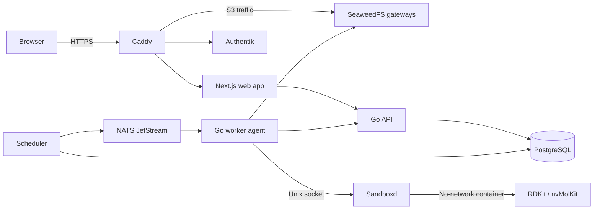

# Library Prep Platform

This repository contains a distributed web service for preparing large
molecular libraries. The control plane and chemistry workers are separate, so
the same setup can run on a small internal cluster or a larger mixed-GPU fleet.

Go runs the control plane and the worker agents. The chemistry code stays in
Python, using RDKit and nvMolKit, and the browser application is built with
Next.js. We deploy the fleet with Docker Compose and connect the hosts over
WireGuard.

## Project status

The code is at the controlled-alpha stage. It is a solid base for deploying to
our own servers, but it is not a turnkey public service yet.

For the first deployment, accounts should be invitation-only and inputs should
be trusted and non-confidential. We still need to run the restore, network,
storage, sandbox, GPU, and fault-injection tests on the target Linux fleet.
Those checks are tracked in [the release gates](docs/RELEASE_GATES.md).

Do not use this deployment for regulated work, HIPAA or GxP data, or chemistry
that cannot tolerate the documented storage failure model.

## How it works

PostgreSQL is the source of truth for jobs and task state. NATS JetStream carries
work to the GPU servers, but the queue can be rebuilt from PostgreSQL if NATS is
lost. Workers claim short leases, renew them while a task is running, and commit
results with a fencing token. That prevents a late or duplicated worker from
overwriting the result of the current attempt.

The worker agent has network credentials, but it does not run chemistry itself.
For each attempt it asks a small root-owned service (`sandboxd`) to start a fresh
container with no network access. Only the input directory, output directory,
and the assigned GPU are made available to that container.

Files are stored in SeaweedFS through its S3 API. Objects are written under an
attempt-specific path and never renamed in place. PostgreSQL decides which
objects belong to a committed result, and background cleanup removes abandoned
uploads and failed attempts later.



The full task protocol, including the failure cases around publishing, leases,
and object commits, is described in
[docs/ARCHITECTURE.md](docs/ARCHITECTURE.md).

## GPU scheduling

Every worker uses a named GPU profile. The profile controls batch size, chunk
size, minimum free memory, and the fallback settings used after an out-of-memory
failure. This keeps machine-specific tuning out of task definitions and allows
different GPU models to use the same worker protocol.

Before accepting work, and again immediately before starting the chemistry
container, the agent takes three `nvidia-smi` samples. It only proceeds when the
assigned GPU has no compute process, enough free VRAM for its profile, and no
more than 5% use.

If somebody else is using the card, the task is deferred without consuming an
execution attempt. This matters because the GPU servers are shared with other
workloads.

The included profiles are conservative starting points, not benchmark results.
They should be adjusted only after the qualification corpus has passed on each
GPU type used in production.

## Repository layout

| Path | What lives there |
| --- | --- |
| `cmd/api` | HTTP API and authentication boundary |
| `cmd/scheduler` | Outbox publisher, retry handling, and reconciliation |
| `cmd/agent` | Networked worker process that claims and runs tasks |
| `cmd/sandboxd` | Narrow host service used to launch chemistry containers |
| `cmd/gc` | Retention and orphan cleanup |
| `internal/platform` | PostgreSQL state machine, leases, fencing, and workflow code |
| `internal/gpu` | GPU inspection and idle-card checks |
| `internal/sandbox` | The client and policy for the offline runner |
| `chemistry_runner` | Input profiling, sharding, conformers, and result manifests |
| `web` | Next.js application and OIDC session handling |
| `migrations` | Database schema and state-transition constraints |
| `deploy` | Compose files, Ansible roles, Caddy, systemd, and backup configuration |

The older standalone commands, `library_pipeline.py` and
`run_conformers_chunked.py`, are intentionally kept in the root of the
repository. They are still useful when testing the scientific pipeline without
the distributed service.

## Running the checks

The pinned development versions are Go 1.26.5 and pnpm 11.7.0.

```bash
go test ./cmd/... ./internal/...
go vet ./cmd/... ./internal/...

python -m pytest
python -m compileall -q chemistry chemistry_runner

cd web
pnpm install --frozen-lockfile
pnpm lint
pnpm build
pnpm audit --prod
```

You can also validate each Compose project without starting it:

```bash
docker compose -f deploy/control/compose.yml --env-file .env.example config --no-env-resolution
docker compose -f deploy/worker/compose.yml --env-file .env.example config --no-env-resolution
docker compose -f deploy/storage/compose.yml --env-file .env.example config --no-env-resolution
```

These commands check the source tree and generated configuration. They do not
replace testing on Linux with the real NVIDIA driver, AppArmor profile,
WireGuard network, and storage volumes.

## Deployment notes

Start with [docs/DEPLOYMENT.md](docs/DEPLOYMENT.md). The values in
`.env.example` are placeholders; production secrets and PKI material should be
rendered through Ansible Vault. Container images must be built, scanned, tested,
and pinned by digest before they are added to the real inventory.

The other useful references are:

- [Operations and recovery](docs/OPERATIONS.md)
- [Security model](docs/SECURITY.md)
- [GPU and package release matrix](docs/RELEASE_MATRIX.md)
- [Release gates](docs/RELEASE_GATES.md)

The main operational targets for alpha are a four-hour control-plane recovery
time and a PostgreSQL recovery point within five minutes. Meeting those targets
depends on working pgBackRest archives and regular restore practice, not just on
the configuration being present in this repository.
