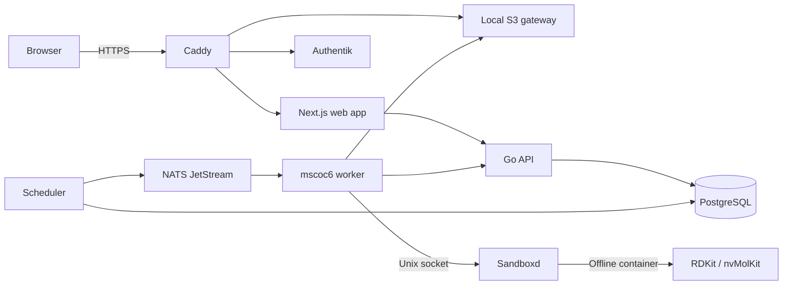

# Library Prep Platform

This repository contains a web service for preparing large molecular
libraries. Users upload through a Next.js website, PostgreSQL owns job state,
NATS JetStream carries queued tasks, and exactly one worker on `mscoc6` runs the
chemistry pipeline.

The platform deliberately does **not** fan user jobs out across the wider
cluster. When the approved GPU on `mscoc6` is busy, work remains queued.

## Project status

The code is at the controlled-alpha stage. Accounts must be invitation-only and
inputs must be trusted and non-confidential. The target host still needs to pass
the restore, storage, sandbox, GPU, and fault-injection gates in
[docs/RELEASE_GATES.md](docs/RELEASE_GATES.md).

Do not use this deployment for regulated work, HIPAA or GxP data, or chemistry
that cannot tolerate the documented single-host failure model.

## Execution ownership

The host has a dedicated non-login service account named `libraryprep`. Its
numeric UID/GID is 65532, matching the agent and chemistry containers. Attempt
and scratch data live under `/srv/library-prep/attempts`; nothing runs from a
personal account or home directory.

The root-owned `sandboxd` service is the only component allowed to ask Docker to
start a chemistry container. The networked worker does not have Docker socket
access. Each chemistry attempt runs offline, non-root, with a read-only root
filesystem and bounded CPU, RAM, GPU, time, scratch, and output.

## How it works


```mermaid
flowchart LR
    Browser -->|HTTPS| Caddy
    Caddy --> Web["Next.js web app"]
    Caddy --> Authentik
    Caddy --> Storage["Local S3 gateway"]
    Web --> API["Go API"]
    API --> Postgres[(PostgreSQL)]
    Scheduler --> Postgres
    Scheduler --> NATS["NATS JetStream"]
    NATS --> Agent["mscoc6 worker"]
    Agent --> API
    Agent --> Storage
    Agent -->|Unix socket| Sandboxd
    Sandboxd -->|Offline container| Chemistry["RDKit / nvMolKit"]
```

All application services share one private Docker network on `mscoc6`. Only
TCP 80/443 is public. PostgreSQL, NATS, the API, storage internals, and
monitoring have no public host port.

PostgreSQL is the source of truth for jobs and task state. JetStream may be
rebuilt from PostgreSQL. Workers claim short leases and commit with fencing
tokens, preventing a late attempt from overwriting the winning result.

Files use SeaweedFS through its S3 API because the browser upload and download
flow already relies on multipart presigned URLs. In the single-host design the
object store has one local copy. PostgreSQL backups must therefore be written
to a separately managed external filesystem, and completed artifacts should be
treated as temporary seven-day outputs rather than durable archival storage.

## GPU scheduling

There is one worker identity, `mscoc6`, with
`WORKER_MAX_CONCURRENCY=1`. Before accepting GPU work and immediately before
launch, the agent takes three `nvidia-smi` samples. It proceeds only when the
configured GPU UUID has no compute process, enough free VRAM for its qualified
profile, and at most 5% utilization.

The repository currently contains RTX 4090 and RTX 5090 profiles. If the GPU in
`mscoc6` is different, add and scientifically qualify a matching profile before
deployment. Do not label an untested card as one of the existing profiles.

## Repository layout

| Path | What lives there |
| --- | --- |
| `cmd/api` | HTTP API and authentication boundary |
| `cmd/scheduler` | Outbox publishing, retries, and reconciliation |
| `cmd/agent` | The sole queued worker process on `mscoc6` |
| `cmd/sandboxd` | Root-owned, allowlisted offline container launcher |
| `cmd/gc` | Retention and orphan cleanup |
| `internal/platform` | PostgreSQL state machine, leases, fencing, and workflow |
| `internal/gpu` | GPU inspection and idle-card checks |
| `chemistry_runner` | Profiling, sharding, conformers, and result manifests |
| `web` | Next.js application and OIDC session handling |
| `deploy/mscoc6` | Current single-host Compose project |
| `deploy/ansible` | Current single-host provisioning automation |
| `deploy/control`, `deploy/worker`, `deploy/storage` | Retired seven-host reference files; do not deploy |

## Running the checks

```bash
go test ./cmd/... ./internal/...
go vet ./cmd/... ./internal/...

python -m pytest
python -m compileall -q chemistry chemistry_runner

cd web
pnpm install --frozen-lockfile
pnpm lint
pnpm build
pnpm audit --prod
```

Validate the current Compose project with production-shaped environment files:

```bash
docker compose \
  -f deploy/mscoc6/compose.yml \
  --env-file /path/to/images.env \
  --env-file /path/to/domains.env \
  --env-file /path/to/compose.env \
  config
```

Start with [docs/DEPLOYMENT.md](docs/DEPLOYMENT.md). Production secrets and
internal certificates must be rendered through Ansible Vault, and all images
must be built, scanned, tested, and pinned by digest.
