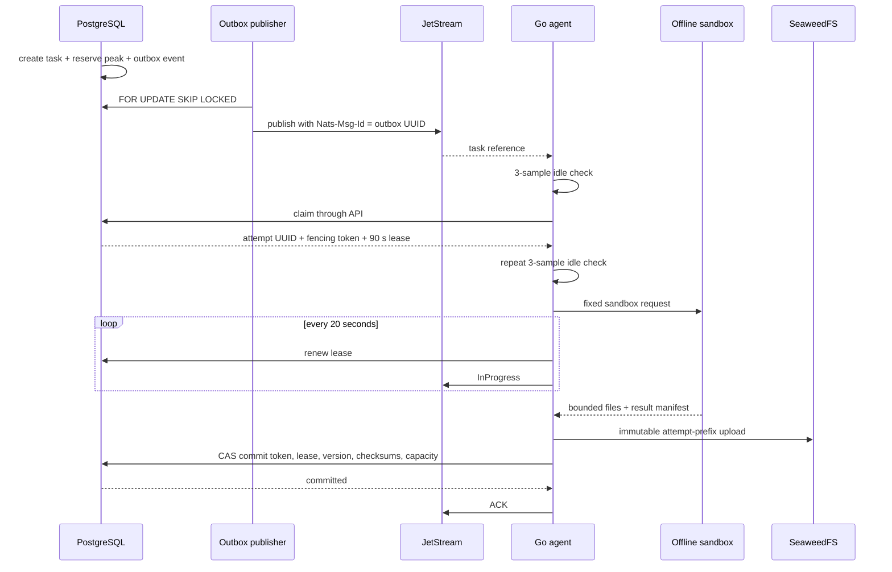

# Architecture and invariants

## Authority and delivery

PostgreSQL is the sole authoritative state machine. JetStream is durable delivery infrastructure and may be destroyed and rebuilt without inventing task state.



A crash after JetStream publication but before the outbox row is marked delivered republishes the same UUID. JetStream deduplication and database claim rules make that harmless. ACK occurs only after the database commit.

## Job workflow

1. A completed, checksum-verified upload creates a `profile` CPU task and server-owned peak reservation.
2. The offline profiler applies structural safety limits and writes Parquet plus a cost-weighted shard plan. Fifty thousand records is a ceiling, not a target.
3. The winning profile commit atomically creates GPU `conformer` tasks and their outbox events.
4. A second CUDA OOM or sandbox timeout splits a shard in half. Splitting repeats until a singleton; a failing singleton is quarantined and recorded in the final manifest.
5. Once all live GPU shards succeed or are quarantined, one CPU `finalize` task receives immutable artifact descriptors and writes `manifest.json`.
6. Only the winning fenced finalizer transitions `finalizing -> succeeded`. Its global/user peak reservations shrink to the actual retained input and committed-artifact bytes; they are released only after PostgreSQL-driven deletion succeeds.

All artifacts live under:

```text
jobs/{job_id}/tasks/{task_id}/attempts/{attempt_id}/...
```

There is no object-store rename. Losing attempt prefixes become eligible for garbage collection after 24 hours and only when PostgreSQL proves no committed artifact references them.

## Network

Compose bridge networks are host-local. Cross-host traffic uses WireGuard `10.77.0.0/24`; Ansible installs exact `/32` peers, stable host aliases, and nftables rules.

Only control-host TCP 80/443 is public. Workers reach API 8443 and NATS 4222 through WireGuard. PostgreSQL 5432 accepts only control-local services and the three filer hosts. Storage master, filer, volume, and S3 ports are WireGuard-only.

`objects.example.org` uses split-horizon resolution:

- Public DNS resolves to control-host Caddy.
- Host/container mappings inside the fleet resolve to both S3 gateway WireGuard addresses.
- SeaweedFS `externalUrl` is the same public hostname, so SigV4 Host calculation is identical on internal and browser paths.

API/NATS use mTLS. S3 uses TLS plus client certificates over WireGuard. Each agent has its own certificate, NATS identity, worker UUID, and S3 key.

## Object storage

SeaweedFS 4.29 runs three masters and three volume servers. Every node is a distinct rack and default replication is `010`: an additional copy on a different rack in the same data center. Raw configured volume capacity is approximately 1.6 TB, yielding an operational ceiling of 800 GB (800,000,000,000 bytes) after two copies. Qualification must calibrate that ceiling downward if filesystem and metadata reserves leave less usable space.

Two filer/S3 gateways share dedicated PostgreSQL filer metadata. `storage-init` creates private input/artifact buckets and verifies a 30-day storage safety-net lifecycle plus one-day incomplete-multipart cleanup. PostgreSQL GC remains authoritative for seven-day post-completion artifact visibility, 24-hour attempt cleanup, active-download grace, and orphan reconciliation.

## Capacity

The browser cannot choose reservation values. The API derives the initial estimate from verified input size and requested conformers, then enforces:

```text
retained input
+ predicted working set
+ predicted final output
+ finalization margin
+ retry margin
+ multipart margin
```

Every artifact commit locks the job and rejects a write that would take committed bytes beyond the active global reservation. Sandboxd separately meters output and scratch every second. Host scratch admission is:

```text
ceil(predicted scratch × 1.5) + 5 GiB finalization headroom + 20 GiB host reserve
```

Because output and scratch share the host volume in this deployment, the claim gate additionally requires the task's predicted output bytes to fit; the sandbox meters output and scratch independently against their own hard caps.

Reservation expiry is not treated as free physical capacity. Terminal jobs retain actual input/output bytes against both the fleet and account limits. At seven-day expiration, the job becomes inaccessible first; the GC then deletes artifacts after the active-download grace and deletes an input only after every job/rerun referencing it is expired. The corresponding reservations are released only when those object deletions are recorded successfully.

## GPU profiles

| Setting | RTX 4090 | RTX 5090 |
|---|---:|---:|
| Engine chunk | 50,000 | 100,000 |
| nvMolKit batch | 250 | 500 |
| Batches per GPU | 2 | 4 |
| Required free VRAM | 22,000 MiB | 30,000 MiB |
| OOM fallback chunk | 25,000 | 50,000 |
| OOM fallback batch | 128 | 250 |

Before pulling GPU work and again before sandbox launch, the agent collects three `nvidia-smi` samples. Every sample must show the configured UUID, no compute PID, utilization at most 5%, sufficient free VRAM, and a healthy driver. External GPU use records `blocked_external_gpu`, delayed-NAKs the message, and does not create or increment an execution attempt.

## Sandbox boundary

The long-lived agent handles network and credentials but never imports RDKit. It calls root-owned `sandboxd` over a Unix socket. Sandboxd validates image digest, GPU UUID, attempt paths, resource profile, and fixed entrypoint before invoking Docker.

Each chemistry container has no network, no secrets, read-only root, non-root UID, a read-only input mount, attempt-only output/scratch mounts, all capabilities dropped, no-new-privileges, AppArmor/seccomp, PID/CPU/RAM/disk/time limits, minimal init, and an explicit GPU UUID. The agent never receives `/var/run/docker.sock`.

## Failure policy

| Failure | Database/message result |
|---|---|
| Deterministic invalid chemistry | Rejection artifact; no infrastructure retry |
| External process on GPU | Delivery deferral; delayed NAK; no attempt |
| Temporary dependency outage | 30 s, 2 min, 10 min JetStream backoff with jitter |
| Worker crash | Lease expiry, stale fencing token, redelivery |
| CUDA OOM / sandbox timeout | Fallback attempt, then recursive split and singleton quarantine |
| Checksum or reservation violation | Terminal failure; uncommitted prefix later collected |
| MaxDeliver advisory | Copy to `TASK_DLQ`, update DB, delete source message |

## Deliberate alpha failure domains

The control host still contains public edge, Authentik, API, scheduler, PostgreSQL, NATS, and monitoring hooks. Loss of that host stops new work; the alpha RTO is four hours. Object data has two copies across hosts but no site-loss guarantee. NATS is one node because it is reconstructable. PostgreSQL targets a five-minute RPO through continuous WAL archiving and encrypted base backups to two repository hosts.
