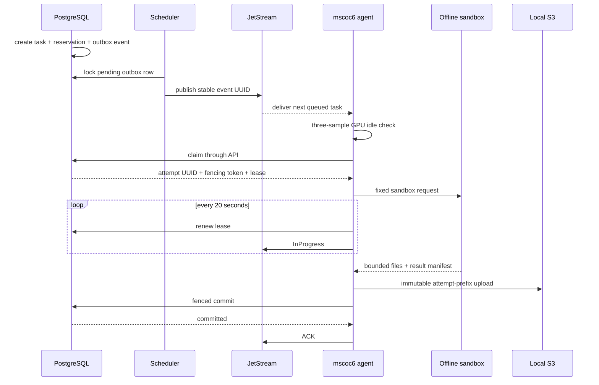

# Architecture and invariants

## Approved execution boundary

All website-submitted work executes on `mscoc6`. There is one registered worker
identity, one configured GPU UUID, and `WORKER_MAX_CONCURRENCY=1`. The worker may
consume both CPU and GPU task subjects, but tasks run one at a time.

The scheduler may split a large chemistry job into multiple shards after
profiling or retry handling. Splitting is a data-management mechanism, not
cluster fan-out: every shard returns to the same queue and waits for the sole
`mscoc6` worker.

No personal account or home directory participates in execution. The host
account `libraryprep` is non-login UID/GID 65532. That number matches the agent
and chemistry containers, and it owns `/srv/library-prep/attempts`.

## Authority and delivery

PostgreSQL is the sole authoritative state machine. JetStream is durable
delivery infrastructure and may be destroyed and rebuilt without inventing
task state.


```mermaid
sequenceDiagram
    participant DB as PostgreSQL
    participant O as Scheduler
    participant JS as JetStream
    participant W as mscoc6 agent
    participant S as Offline sandbox
    participant OBJ as Local S3

    DB->>DB: create task + reservation + outbox event
    O->>DB: lock pending outbox row
    O->>JS: publish stable event UUID
    JS-->>W: deliver next queued task
    W->>W: three-sample GPU idle check
    W->>DB: claim through API
    DB-->>W: attempt UUID + fencing token + lease
    W->>S: fixed sandbox request
    loop every 20 seconds
        W->>DB: renew lease
        W->>JS: InProgress
    end
    S-->>W: bounded files + result manifest
    W->>OBJ: immutable attempt-prefix upload
    W->>DB: fenced commit
    DB-->>W: committed
    W->>JS: ACK
```

A crash after queue publication but before the outbox row is marked delivered
republishes the same event UUID. JetStream deduplication and database claim
rules make that harmless. ACK occurs only after the database commit.

## Job workflow

1. A checksum-verified upload creates a CPU profile task.
2. Profiling applies structural limits and creates a cost-weighted shard plan.
3. GPU conformer tasks enter one shared queue.
4. `mscoc6` runs one task when its configured GPU is genuinely idle.
5. A repeated CUDA OOM or timeout splits the shard and queues the children.
6. After all shards succeed or are quarantined, a CPU finalizer writes the
   manifest.
7. The winning fenced finalizer transitions the job to `succeeded`.

Artifacts use immutable keys:

```text
jobs/{job_id}/tasks/{task_id}/attempts/{attempt_id}/...
```

Losing attempts become eligible for PostgreSQL-driven cleanup after 24 hours.

## Single-host network

All long-lived services share a private Docker bridge on `mscoc6`.

- Caddy alone publishes TCP 80/443.
- PostgreSQL, NATS, the API, SeaweedFS internals, and exporters have no public
  host port.
- The API, NATS, and S3 gateway still use internal certificates and mTLS.
- The website uses the API certificate as a backend-for-frontend identity.
- The worker certificate CN is `mscoc6` and is bound to its stable worker UUID.
- The Docker socket is never mounted into the web, API, Authentik, or agent
  containers.

Three public DNS names point to the approved web endpoint:

```text
app.example.org
auth.example.org
objects.example.org
```

## Object storage

SeaweedFS remains because the browser protocol uses S3 multipart uploads,
checksums, ranges, and presigned URLs. The current deployment runs one master,
one volume, one filer, and one S3 gateway on `mscoc6` with replication `000`.

This is one local object copy, not durable cluster storage. PostgreSQL backups
must go to a separately managed mounted filesystem. Completed artifacts remain
temporary seven-day outputs and users must download anything they need to keep.

The configured global storage ceiling must be measured from the actual
`/srv/library-prep` filesystem after reserving space for PostgreSQL, objects,
Docker, scratch, retries, and the 20 GiB emergency reserve. It is not the old
800 GB fleet value.

## GPU admission

The worker is pinned to one exact GPU UUID. Before accepting work and again
before sandbox launch, it takes three `nvidia-smi` samples. Every sample must
show:

- the configured UUID;
- no compute PID;
- no more than 5% utilization;
- enough free VRAM for the qualified profile;
- a healthy driver.

External GPU use records `blocked_external_gpu`, delays the queue message, and
does not consume an execution attempt.

The code currently knows `rtx4090` and `rtx5090` profiles. A different card in
`mscoc6` requires a new named profile and a retained scientific qualification
corpus before use.

## Sandbox boundary

The networked agent owns service credentials but never imports RDKit. It calls
root-owned `sandboxd` over a Unix socket whose group is `libraryprep`.

Each chemistry container has no network, no secrets, a read-only root,
non-root UID/GID 65532, a read-only input mount, attempt-only output and scratch
mounts, all capabilities dropped, no-new-privileges, AppArmor/seccomp, bounded
PID/CPU/RAM/disk/time, and only the allowlisted GPU UUID.

## Failure domain

`mscoc6` is intentionally a single execution and control failure domain. If it
is offline:

- the website and job API are unavailable;
- no task can execute;
- locally stored uploads and artifacts may be unavailable or lost;
- recovery depends on rebuilding the host and restoring PostgreSQL from the
  external backup mount.

This design is appropriate only for the controlled alpha agreed with the
service owner. It makes no high-availability or site-loss claim.
